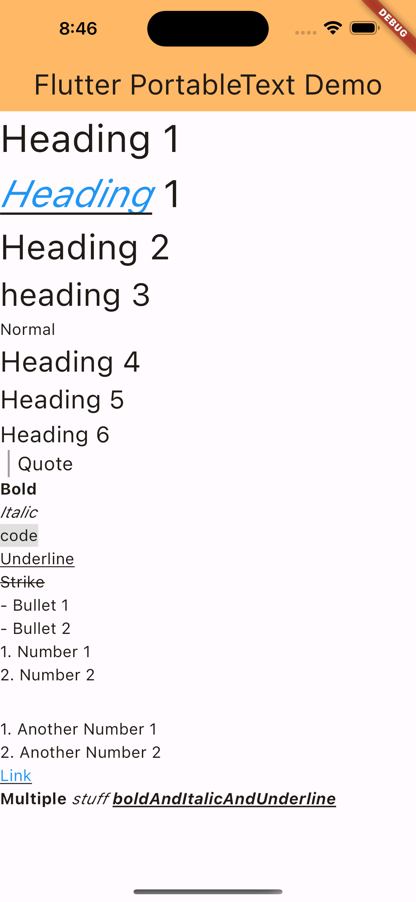

## WIP

Render PortableText used in Sanity using Flutter.



## Features

Render the RichText used in [Sanity.io](www.sanity.io) following the [PortableText](https://github.com/portabletext/portabletext) specifications.

## Getting started

Install the package using

```
flutter pub add flutter_portabletext
```

## Usage

```dart
    List<PortableText>? portableText;
    @override
    void initState() {
      super.initState();

      initPortableTextWithSanity() async {
        final sanityClient = SanityClient(
          dataset: sanityVariable['dataset']!,
          projectId: sanityVariable['projectId']!,
        );

        final response = await sanityClient.fetch('*[_type == "post"]');

        final content = response[0]['content'] as List<dynamic>;

        final List<PortableText> listPortableText = [];
        for (var dynamicPort in content) {
          final portableText = PortableText.fromJson(dynamicPort);
          listPortableText.add(portableText);
        }
        setState(() {
          portableText = listPortableText;
        });
      }

      initPortableTextWithSanity();

      initPortableTextWithJson() async {
        rootBundle.loadString('assets/ex.json').then((value) async {
          final data = await json.decode(value) as List<dynamic>;
          final List<PortableText> listPortableText = [];
          for (var dynamicPort in data) {
            final portableText = PortableText.fromJson(dynamicPort);
            listPortableText.add(portableText);
          }
          setState(() {
            portableText = listPortableText;
          });
        });
      }

      // initPortableTextWithJson();
    }
    
    ...
    SizedBox(
        width: double.infinity,
        child: PortableTextRichText(
        portableText: portableText,
        onTapLink: (value) => print(value),
        ),
    ),
```

## Additional information

If you want to change the values please update as followed.

```dart
    this.mapStyle = const {
      'h1': TextStyle(fontSize: 24),
      'h2': TextStyle(fontSize: 22),
      'h3': TextStyle(fontSize: 20),
      'h4': TextStyle(fontSize: 18),
      'h5': TextStyle(fontSize: 16),
      'h6': TextStyle(fontSize: 14),
      'blockquote': TextStyle(fontSize: 12),
    },
    this.quoteStyle = const TextStyle(
      fontSize: 12,
    ),
    this.normalStyle = const TextStyle(fontSize: 10),
    this.externalLinkColor = const Color(0xFF0645AD),
    this.codeBackgroundColor = Colors.grey,
    this.externalLinkDecoration = TextDecoration.underline,
```

Custom fields will arrive soon.
Breaking change might happens in following versions the project is still early on.
